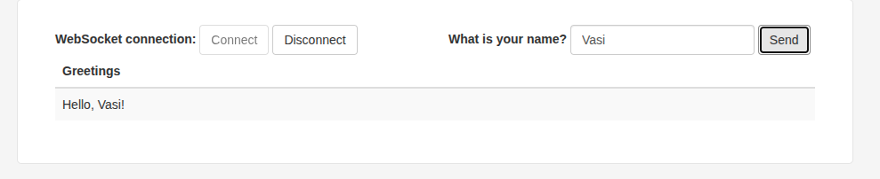

### Работа с WebSocket со Spring Boot

В проекте демонстрируется передача текстовых сообщений через веб сокеты. 
Сообщения, отправляемые из браузера одного компьютера, принимаются в браузерах на других компьютерах.  

Java 21
Проект из [https://github.com/spring-guides/gs-messaging-stomp-websocket](https://github.com/spring-guides/gs-messaging-stomp-websocket).
Оригинальный [Readme.adoc](https://github.com/spring-guides/gs-messaging-stomp-websocket/Readme.adoc)

````shell
./mvnw spring-boot:run
````

или

````shell
./run.sh
````

Открыть: [http://192.168.1.79:8080/](http://192.168.1.79:8080/). __НЕ__ [http://127.0.0.1:8080](http://127.0.0.1:8080)
В консоль __браузера__ выведется информация о соединении:

````text
Connected: CONNECTED
heart-beat:0,0
version:1.2
content-length:0
````

Нажать "Connect" (кнопка станет серой), ввести имя и нажать "Send".
В "Greetings" появится "Hello, имя".

После подключения, клиентский браузер будет держать соединение с сервисом. 
При пропадании связи (на пример при __перезагрузке сервисА__) клиент будет периодически пытаться с сервисом.
Результаты переподключения будут отображаться в консоли браузера.



Далее, вводимые имена будут __появляться__ в списке (index.html <tbody id="greetings">). 

app.js:
````javascript
function showGreeting(message) {
    $("#greetings").append("<tr><td>" + message + "</td></tr>");
}
````

Сообщения появляются __по подписке__, см.ниже "Подписка", "stompClient.subscribe".

Если открыто несколько браузеров (firefox, chrome и т.д.) и они все подписаны на прием, то сообщения будут появляться __во всех__ из них одновременно.

### Что такое Web Socket?

WebSocket (веб-сокет) — сетевой протокол передачи данных, который обеспечивает постоянное двустороннее (full-duplex) 
соединение между клиентом и сервером через одно TCP-соединение. Главная особенность — поддержка актуальности 
соединения без новых запросов от клиента.

### Как это работает?

В __app.js__ использован __STOMP.js__ — это __JavaScript__-библиотека для работы с протоколом __STOMP__ (Simple Text Oriented Messaging Protocol). 
Она позволяет клиентам подключаться к сервисам сообщений через __WebSocket__ или TCP (в данном проекте используется __WebSocket__), 
обеспечивая обмен сообщениями между клиентами и серверами.

Клиент __app.js__ посылает сообщение в __WebSocket__. 

[app.js](https://github.com/cherepakhin/messaging-stomp-websocket/blob/main/src/main/resources/static/app.js):

URL __брокера__:

````javascript
const stompClient = new StompJs.Client({
    brokerURL: 'ws://127.0.0.1:8080/gs-guide-websocket'
});
````

StompJS импортирован в [index.html](https://github.com/cherepakhin/messaging-stomp-websocket/blob/main/src/main/resources/static/index.html): 

````html
<script src="https://cdn.jsdelivr.net/npm/@stomp/stompjs@7.0.0/bundles/stomp.umd.min.js"></script>
````
Отправка сообщения в [app.js](https://github.com/cherepakhin/messaging-stomp-websocket/blob/main/src/main/resources/static/app.js):

````javascript

function sendName() {
    stompClient.publish({
        destination: "/app/hello",
        body: JSON.stringify({'name': $("#name").val()})
    });
}

````
Это не POST запрос, это что-то типа канала. Открывается соединение (труба) для обмена данными.

Прием сообщений от фронта:

````java
@Controller
public class GreetingController {

	@MessageMapping("/hello")
	@SendTo("/topic/greetings") // отправка в ресурс /topic/greetings
	public Greeting greeting(HelloMessage message) throws Exception {
		Thread.sleep(1000); // simulated delay
		return new Greeting("Hello, " + HtmlUtils.htmlEscape(message.getName()) + "!");
	}
}
````

__Внимание__ на параметр "/topic/greetings" и на backend, и на frontend.

### Подписка

И подписка и реакция на приём сообщений от сервера (от WebSocket) на стороне клиента (app.js):

````javascript
stompClient.onConnect = (frame) => {
    setConnected(true);
    console.log('Connected: ' + frame);
    stompClient.subscribe('/topic/greetings', (greeting) => { // подписываемся на ресурс /topic/greetings
        showGreeting(JSON.parse(greeting.body).content); // отображаем полученное сообщение из ресурса
    });
};

````

Оригинальный [doc/Readme.md](doc/Readme.md).
